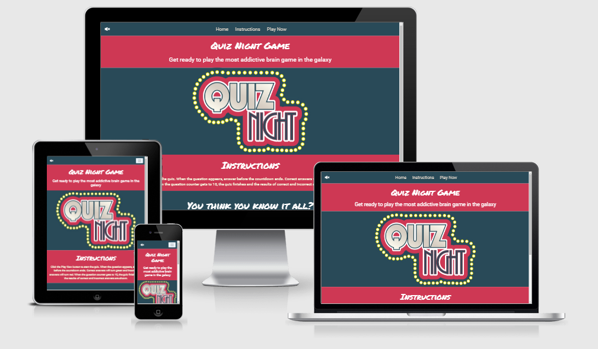
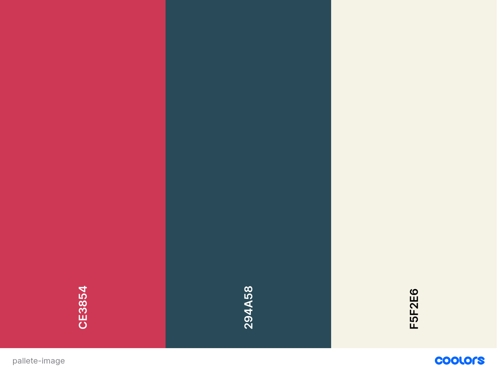
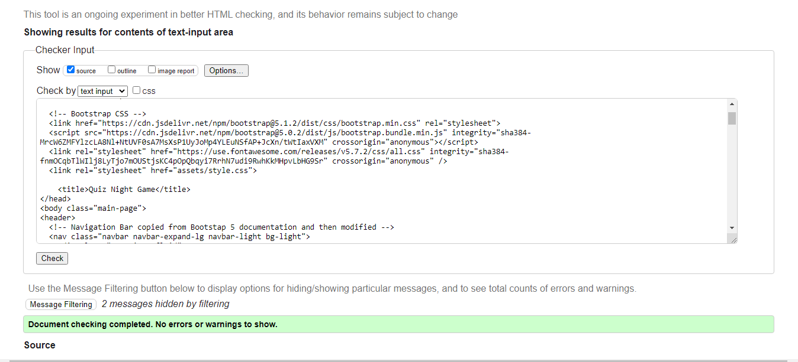
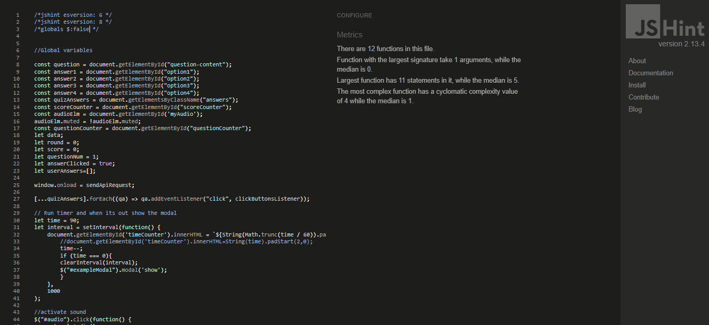
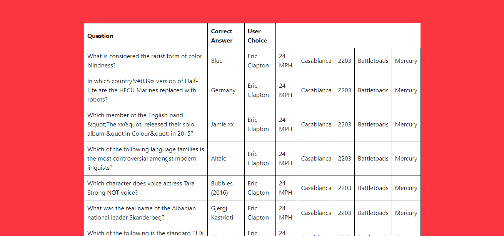
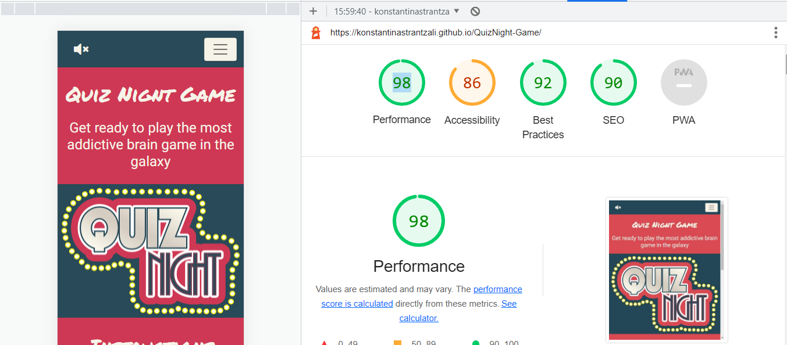

<h1 align="center">The Quiz Night Game</h1>

*Created using* [Am I Responsive](http://ami.responsivedesign.is/)
 

The Quiz Night Game is a fun quiz game. The game objective is to answer in 10 question before the time runs out. This game is a great brain training tool, which can help the user to improve or test their general knowledge and get better at trivia while having fun. 

The Quiz Night Game website consists of three webpages and one modal created using [HTML5](http://en.wikipedia.org/wiki/HTML5), 
[CSS3](http://en.wikipedia.org/wiki/CSS), the library [Bootstrap](https://getbootstrap.com/), [JavaScript](https://en.wikipedia.org/wiki/JavaScript), 
the JavaScript library [jQuery](https://jquery.com/) and [Open Trivia API](https://opentdb.com/api_config.php).  This project is part of the Full Stack Web Development Program at the [Code Institue](https://codeinstitute.net/) and was created to practically show  my learning and understanding of the Interactive Frontend Development module. 

Click <a href="">here</a> to play the game online.
 

## **Table of Contents**
1. [**User Experience (UX)**](#ux)
    - [User Stories](#user-stories)
        - [New User](#new-user)
        - [Returning User](#general-user)
        - [Site Owner](#site-owner)
2. [**User Centered Design**](#user-centered-design)
    - [1) The Strategy Plane](#1-strategy-plane)
    - [2) The Scope Plane](#2-scope-plane)
    - [3) The Structure Plane](#3-structure-plane)
         - [Features](#features)
    - [4) The Skeleton Plane](#4-skeleton-plane)
        - [Wireframes](#wireframes)
    - [5) The Surface Plane](#5-surface-plane) 
        - [Design](#design)
        - [Colour Scheme](#colour-scheme)
        - [Typography](#typography)
3. [**Technologies Used**](#technologies-used)
4. [**Testing**](#testing)
    - [Performance](#performance)
    - [Responsiveness](#responsiveness)
    - [Tested User Stories](#tested-user-stories)
    - [Bugs](#bugs)
5. [**Deployment**](#deployment)
6. [**Credits**](#credits)
    - [Content](#content)
    - [Media](#media)
    - [Acknowledgements](#acknowledgements)

 

---
## UX

### User Stories

#### New User

As a new user:

- Before I start the quiz game I would like to be intuitively aware of the instructions and rules. 
- I would like to play a quiz game presented in a visually appealing design and I can choose the category I'm most interested in playing. 
- I would like to select an answer and receive the correct or incorrect result with a visual response. 
- As a first time user I would like to intuitively navigate through the site with ease.

#### Returning User

As a returning user:

- I would like to be updated about how I am progressing in the game and be able to check my score.
- I would like to be exposed to different questions and improve my knowledge on different topics. 
- I would like to be notified if I have past the time limit or lost. 
- I would like to modify settings such as toggling  the game audio on and off.

#### Site Owner
As the owner of the Quiz Night Game:

- I want to provide the users a fun, enjoyable playing experience. 
- I want to provide feedback to users as they progress throughout the game. 
- I want to provide to users a simple site to navigate and easy to use. 
- I want to provide to users additional social links where they can find more information and get connected with other fans. 

 

##### back to [top](#table-of-contents)

## User Centered Design
### 1 Strategy Plane

The creation of User Stories influenced the User Centered Design process, as many decisions were made regarding the game's layout, features and design.
The main goal of the app game is to provide users with a fun, enjoyable and engaging game experience. The target audience of the game are fan of quizzes of any adult age, who want to have fun playing an entertaining game while exercising their brain.

The design of the site has been made on classic quiz format, by simply displaying the questions and answers and vivid colors have been choosen to satisfy the user's fun mood.
 

##### back to [top](#table-of-contents)

### 2 Scope Plane

The specific requirements and the fuctionality the game will offer is that the user should be able to:

- Start a game.
- Read the instructions of the game.
- Read the questions.
- Select only one answer.
- Instantly receive the correct or incorrect result with a visual response of the buttons.
- Be updated for the score and the number of questions are left.
- See how much time is left.
- Restart the game.
- Navigate easily through the pages.

 

### 3 Structure Plane

After doing some research and visiting other quiz game websites, some new user needs were identified and some new features were chosen to apply. At this point the users should be able to:

- See all the questions, the correct answers and the choices they made at the end of the game.
- Mute and unmute the sound effects.
- See a 'game over' message when they run out of time and be able to choose if they want to try again or return back to the home page.
- See the score they achieved.

### Features

### Existing Features

- Home Page has a Navbar, the links link to the Instructions section and Play Now Buttons which start the game once they pressed. The navigation bar is responsive across different screens and resolutions. Navbar changes to hamburger menu for small screen sizes.
- A favicon, with the logo of the website displayed on the web brower's tab, allows the user to identify the website by sight.
- A large, responsive, quiz themed image displayed on the home page and make the user immediately understands the Quiz logo.
- The colors of the website perfectly match with the logo image on the home page.
- The questions are showed to the users after calling the Open Trivia API and they are always different.
- Selected buttons turn to red color when the answer is incorrect and to green color when the answer is correct.
- Correct answers award 100 points and directly increase the score.
- A one-minute countdown timer is displayed while the user answers the question.
- Game Over modal appears when the time run out.
- The number of remaining questions is updated each time the user goes to the next question.
- Users are able to see their final score at the end as well as all the questions answered and the results.
- Mute and unmute icons allows the user to turn off-on, game sound effect.

### Features to be implemeneted in the Future
- Further levels of increasing difficulty.
- Further question categories.
- A themed playing environment that changes depending question category.

 

##### back to [top](#table-of-contents)
---
### 4 Skeleton Plane

[Balsamiq](https://balsamiq.com/), is the UI wireframing tool that was used to create wireframes for each site page as it would appear on different screens such as desktop, mobile and ipad.

#### Wireframes
### Home Page

The home page remained exactly the same as designed in the Wireframes for all the screen sizes, desktop, mobile and ipad. 

- [Desktop Home Page](documentation/wireframes/mainPage-deskotop-mockup.png)
- [Mobile Home Page](documentation/wireframes/homePage-mobile-mockup.png)
- [Ipad Home Page](documentation/wireframes/mainPage-ipad-mockup.png)

### Quiz Game Page
Quiz Game Page remained relatively the same, apart of the answers button layout on mobile and ipad viewports which changed to full width on the screen size. A new modal feature added when the timer run out, which allows the user to return back home or play again.
- [Desktop Quiz Page](documentation/wireframes/gamePage-deskotop-mockup.png)
- [Mobile Quiz Page](documentation/wireframes/gamePage-mobile-mockup.png)
- [Ipad Quiz Page](documentation/wireframes/gamePage-ipad-mockup.png)

### Results Page

Results remained exactly the way designed in the Wireframes.
- [Desktop Results Page](documentation/wireframes/resultsPage-desktop-mockup.png)
- [Mobile Results Page](documentation/wireframes/resultsPage-mobile-mockup.png)
- [Ipad Results Page](documentation/wireframes/resultsPage-ipad-mockup.png)

 

##### back to [top](#table-of-contents)
---

### 5 Surface Plane

#### Design

#### Colour Scheme

The colour scheme of the website was chosen by uploading Quiz Night Game image to 
[coolors.co](https://coolors.co/ffbe0b-fb5607-ff006e-8338ec-3a86ff). Using the color picker, the hexidecimal equivalent colours of the image were identified and chosed for the project.
At the beginning a different colour pallete chosed but going further with the project it looked very shouting and loud color schemed thus it changed.

#### Typography
*'Permanent Marker'* was chosen as the main heading font, as it's engaging and fun and can stand out in contrast to second font family used across the project. 
 
In order to create a visual unity between headings and titles and the rest content, *Roboto* was chosen for the text used within the body of the site. This font matches with the content of the project as it is modern, very easy on the eyes and simple to read.

Overall the project is responsive across different resolutions. I used CSS media queries to make fonts smaller for mobile and ipad devices and to keep all the content on a single page, so the user doesn't looses focus due to need to scroll.
Also I used Bootstrap as the main framework to keep the project responsive.

## **Technologies Used**

- [HTML](https://www.w3schools.com/html/)
    - Used as the basic building block for all the pages of the project.
- [CSS](https://www.w3schools.com/css/)
    - Used to Style all the web content across the project.
- [JavaScript](https://www.javascript.com/)
    - Used as the main programming language to manipulate HTML dom and create the dynamic, interactive elements of the website.
- [Bootstrap](https://getbootstrap.com/)
    - Used as main framework to structure the website layout and ensure that it was responsive on all devices
- [jQuery](https://jquery.com/)
    - Used only for toggling sound effect.
- [Google Fonts](https://fonts.google.com/)
    - Permanent Marker and Roboto the 2 main fonts of the project were found from Google Fonts.
- [Font Awesome](https://fontawesome.com/)
    - Font Awesome provided the icons for Social media on Footer as well as the mute and unmute sound icons.
- [Google Developer Tools](https://developers.google.com/web/tools/chrome-devtools)
    - Primary method for testing, debbuging and fixing issues.
- [Coolors](https://coolors.co/ffbe0b-fb5607-ff006e-8338ec-3a86ff). 
    - Used to find a suitable colour scheme for the site.
- [ZapSplat]
   - Used to search for the sound effect of the project.
- [Github](https://github.com/)
    - Used to to host the deployed site.
- [Git](https://git-scm.com/)
    - Version control by utilizing the Gitpod terminal to commit to Git and Push to GitHub.
- [Gitpod](https://gitpod.io)
    -  The online Development Enviroment used to build the project. 
- [Balsamiq](https://balsamiq.com/)
    - Used to create the wireframes for the project.
- [HTML Validator](https://validator.w3.org/)
    - Used to validate HTML from errors and warnings.
- [CSS Validator](https://jigsaw.w3.org/css-validator/)
    - Used to validate CSS from erros and warnings. 
- [JavaScript Validator](https://jshint.com/)
    - Used to detect errors, bugs and problems in Javascript.
- * [The Open Trivia API](https://opentdb.com/api_config.php). Used to source the questions and answers of the quiz.

## Testing
Code was checked by [W3C Markup Validation Service](https://validator.w3.org/) and ensured that the website contains valid HTML. As a result of this process the site has no HTML erros.

  
  
- [View quiz-page Validation results](documentation/validation/quiz-page-HTML-validation.png)
- [View results-page Validation results](documentation/validation/results-HTML-validation.png)
  

[W3C CSS Validation Service](https://jigsaw.w3.org/css-validator/) checked CSS code and tested how valid code contained. As a result of this process the all the bugs fixed and the file returned no erros.

 

To test the validity of the JavaScript  I used [JSHint](jshint.com).
When I first parsed my code through JShint came with many errors. Most of them were corrected with the use of /*jshint esversion: 6 */  and /*jshint esversion: 8 */ as well as /*globals $:false */ for jQuery dollar sign. Also I had many missing semi-colons and syntactical errors.

-[View results.js Validation](documentation/validation/JSHint-resutls.png).
  
Another bug that took me a long time to fix was that the API data was not displaying properly, as some specific characters did not appear to be recognized. As you can see in the example below, in question 6 there are &#039:s characters that replace the apostrophe ('). After a lot of research, I discovered that I had to display the data using .innerHTML which allows everything to be read and replaced in a given DOM component instead of the .createTextNode I used in the beginning.

 
##### back to [top](#table-of-contents)
---

### Performance

The website was tested using the [Google Chrome Developer Tools](https://developers.google.com/web/tools/chrome-devtools) Lighthouse test. 
Initially the site received a 90% rating on performance, due to the size of the images and 89% on accessibility due to inaccessible button names and non discernible names of the links.

New aria-labels added to buttons and link so they clearly describe the action, image was compressed using an online image compressor site, [Optimizilla](https://imagecompressor.com) and then uploaded to the site. As a result, the subsequent test results showed marked improvement.

##### back to [top](#table-of-contents)
---

### Responsiveness
